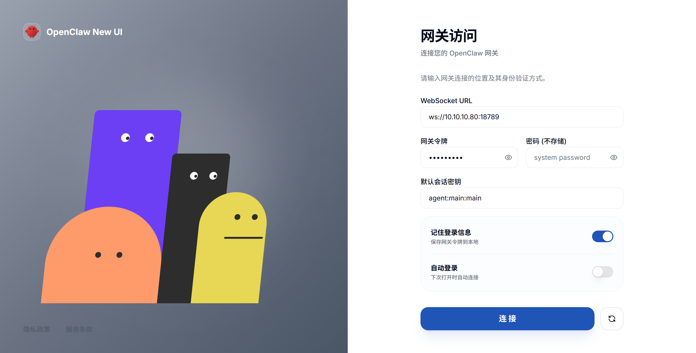
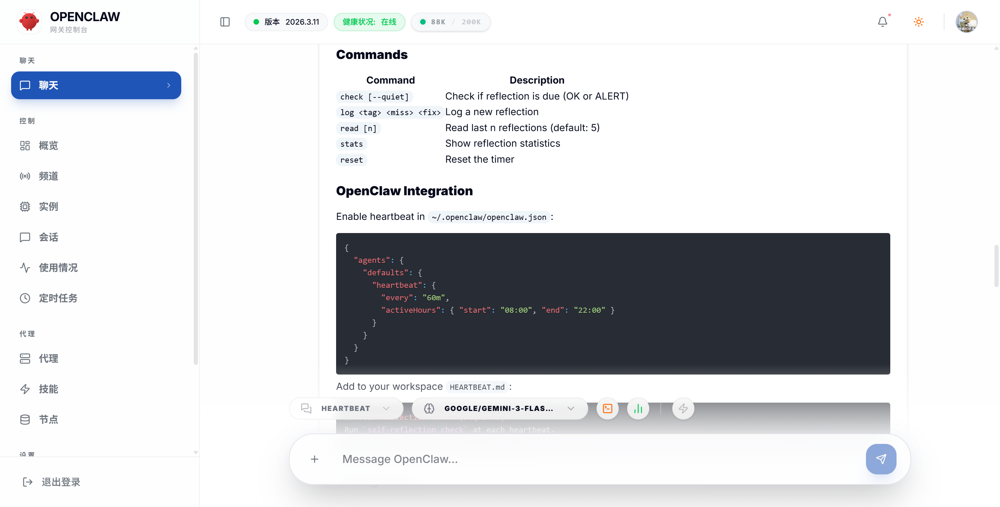

# 🦀 OpenClaw New UI

**OpenClaw New UI** 是一款专为 OpenClaw 网关设计的现代化、高性能、且极富设计感的 Web 控制台。基于 Next.js 打造，旨在为用户提供最流畅的 AI 交互体验与最直观的网关管理能力。

---

## 🖼️ 界面预览 (Interface Preview)

<p align="center">
  
  <br>
  <em>登录界面 - 极简流线型设计</em>
</p>

<p align="center">
  
  <br>
  <em>操作界面 - 动态流式渲染与简化模式</em>
</p>

---

## ✨ 核心特性
---

## 💬 微信群交流

<p align="center">
  
  <br>
  <em>扫码加入 OpenClaw New UI 交流群</em>
</p>


- 🎨 **极致美学**：采用模块化玻璃拟态（Glassmorphism）设计，支持灵动的主题切换与细腻的交互动画。
- ⚙️ **智能控制**：
  - **详细输出模式**：一键切换 AI 思考过程（Reasoning）与工具执行记录（EXEC）的显示/隐藏。
  - **极简状态行**：在简化模式下，复杂的工具调用将转换为精致的状态条，保持界面清爽。
- 📊 **动态监控**：实时渲染 Token 消耗概览、会话健康度及系统运行状态。
- 📱 **全平台适配**：针对移动端进行深度优化，确保在手机、平板与桌面端均有完美的响应式体验。
- 🚀 **极速部署**：支持 Docker 容器化一键部署，镜像体积小，启动飞快。
- 🛠️ **多会话管理**：直观的会话切换与管理界面，支持多智能体状态查看。

---

## 🛠️ 技术栈

- **框架**: [Next.js 15 (App Router)](https://nextjs.org/)
- **样式**: [Tailwind CSS 4](https://tailwindcss.com/)
- **组件库**: [Shadcn/UI](https://ui.shadcn.com/)
- **动画**: [Framer Motion](https://www.framer.com/motion/)
- **图标**: [Lucide React](https://lucide.dev/)
- **状态/表单**: [React Hook Form](https://react-hook-form.com/) + [Zod](https://zod.dev/)

---

## 🚀 快速开始

### 方式一：本地开发 (Local Development)

确保已安装 Node.js 20+ 环境：

```bash
# 安装依赖
npm install

# 启动开发服务器
npm run dev
```

打开浏览器访问 [http://localhost:3000](http://localhost:3000) 即可开始使用。

### 方式二：Docker 部署 (推荐)

项目内置了完整的 Dockerfish 支持，支持一键启动：

```bash
# 使用 Docker Compose 启动
docker-compose up -d
```

镜像构建完成后，服务将运行在 `3000` 端口。

---

## 🐳 Docker 指南 (Docker Guide)

### 手动构建镜像
```bash
docker build -t openclaw-new-ui .
```

### 运行容器
```bash
docker run -d -p 3000:3000 --name openclaw-ui openclaw-new-ui
```

---

## 📱 手机端访问

### 网页访问（推荐）

如果您已在服务器上部署了 OpenClaw New UI，可以通过手机浏览器直接访问：

#### 局域网访问
```url
http://<服务器IP>:3000
```

#### 公网访问
```url
http://<您的域名>:3000
# 或
https://<您的域名>   # 如果配置了 HTTPS 反向代理
```

#### 配置域名访问

**Nginx 反向代理配置示例：**

```nginx
server {
    listen 80;
    server_name openclaw.yourdomain.com;  # 替换为您的域名

    location / {
        proxy_pass http://127.0.0.1:3000;
        proxy_http_version 1.1;
        proxy_set_header Upgrade $http_upgrade;
        proxy_set_header Connection 'upgrade';
        proxy_set_header Host $host;
        proxy_set_header X-Real-IP $remote_addr;
        proxy_cache_bypass $http_upgrade;
    }
}
```

**配置 HTTPS（Let's Encrypt 免费证书）：**
```bash
# 安装 Certbot
sudo apt install certbot python3-certbot-nginx

# 获取证书并自动配置 Nginx
sudo certbot --nginx -d openclaw.yourdomain.com
```

---

### Android APK 安装

如需将 OpenClaw New UI 安装为独立 App，请参考 [ANDROID_BUILD.md](ANDROID_BUILD.md) 构建 APK。

**构建完成后：**
1. 将 APK 文件传输到手机
2. 在手机上打开 APK 文件安装
3. 首次安装需要在设置中开启"允许安装未知来源应用"

**APK 安装后配置：**
首次打开 App 时，需要在设置页面填写您的 OpenClaw 网关地址：
- **局域网**：填写 `http://<服务器IP>:<端口>`
- **公网**：填写 `https://<您的域名>`

> 注意：移动端 App 需要能访问到您的 OpenClaw 网关服务，请确保网关地址可从手机网络访问。

---

## 🔐 环境配置

OpenClaw New UI 采用**零后端环境要求**设计。所有网关连接参数（WebSocket URL、Token、密码等）均通过前端登录界面配置，并安全地持久化在您的浏览器 LocalStorage 中。

1. 在登录界面输入您的网关地址与权限信息。
2. 点击“连接”即可进入管理面板。
3. 系统会自动保存设置，下次访问无需重复输入。

---

## 🤝 贡献与反馈

如果您在使用过程中遇到任何问题或有更好的改进建议，欢迎提交 Issue 或 Pull Request。

---

## 📄 开源协议

本项目基于 [MIT License](LICENSE) 开源。

---

<p align="center">
  Made with ❤️ for the OpenClaw Community
</p>
